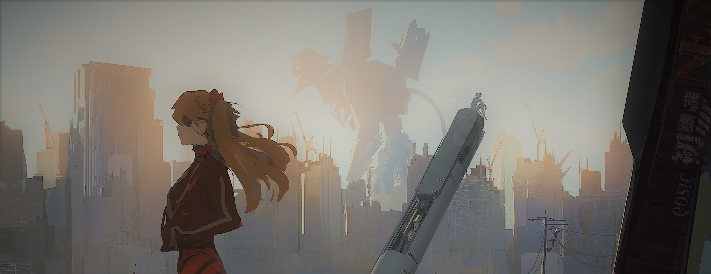

 你好，欢迎。 

# 关于名字
　　全名：**早川　季子**（はやかわ　としこ，Hayakawa　Toshiko）

　　这是一个来自梦境的名字。

# 博客内容

- 书抄（小说为主）
- 笔记（主要为物理及计算机相关）
- 二次元（动画与OST）
- 随笔（呓语）

　　实际上总是挖坑不填，因为太懒。

# 我

　　明日香厨，现在更喜欢兰格雷上尉。

　　一直挣扎，一直彷徨，有时前进，但绝不再逃避。

　　详见：[非健全人的自我救赎](https://blog.chen-137.me/tags/非健全人的自我救赎/)

***

 **此图片为p站画师<a href="https://www.pixiv.net/users/13447132/">@qosic</a>作品。该作品pixiv id为<a href="https://www.pixiv.net/artworks/80472549/">80472549</a>。色调及尺寸有改动。** 

 **头像为<a href="https://www.utadahikaru.jp">宇多田ヒカル</a>专辑One Last Kiss的<a href="https://www.utadahikaru.jp/music/album/title_20.html">LP海外盤</a>封面。封面角色：式波・アスカ・ラングレー** 
